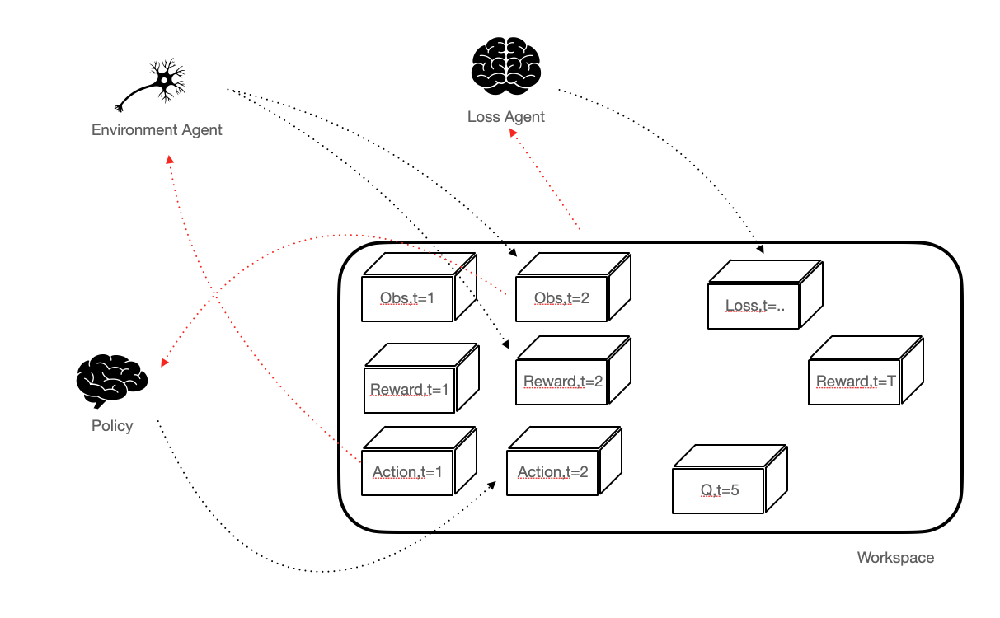
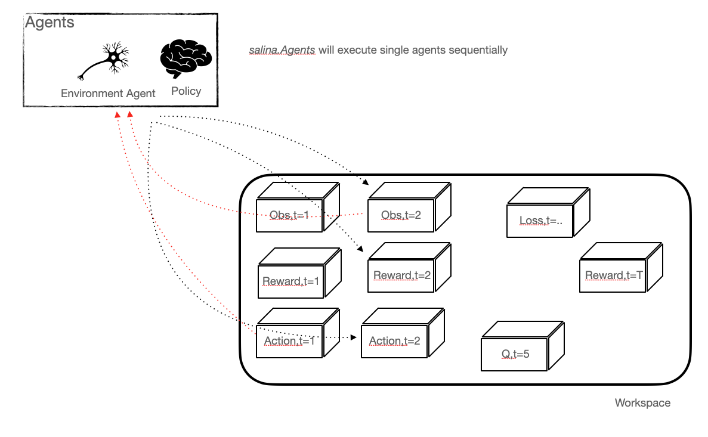
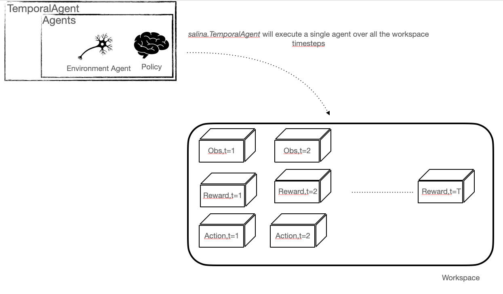

# Principles

## Introduction

The core of `salina` is just two files: [agent.py](../salina/agent.py) and [workspace.py](../salina/workspace.py)

If you want to understand deeply how salina works, you have to understand these two files and that's it. But you can use and develop algorithms without looking at these two files.

## Differences with Pytorch

`salina` just allows to extend `pytorch` such that a temporal dimension is added. In order to achieve this, instead of having `Module`s that take tensors as inputs and return tensors, `salina` proposes `Agent`s that read tensors from a `Workspace` and write tensors into the `Workspace`, as illustrated in the figure. The interesting part is that `Agent`s can thus access information at different timesteps and thus build the information in a sequential way. With such a setting, an agent can access a set of tensors organized by time such as a complete episode, a subset of the history, the previous timestep, etc... This simple 'trick' makes the implementation of sequential models much easier, and allows complex parallelisation schemas as described in the next sections.



## Agents

In salina, instead of manipulating `nn.Module`, you manipulate `Agent`. The difference is that an Agent is **reading and writting** information into a `Workspace`. This `Workspace` is thus used by multiple agents to exchange information.

For instance, in the Reinforcement Learning case, one agent will be the environments, writing `observations`, `reward`, etc... and reading `actions`. Another agent will implement the policy, reading `observations` from the `Workspace` and writing `actions`.

The typical use of an `Agent` is the following:
```
    my_agent = MyAgent()
    my_agent(workspace)
```


## Workspace

A `Workspace` is a set of pytorch tensors organized by `name` and `time`.

Defining a new workspace is done as follows:
```
    workspace = Workspace()
```

A variable in the workspace can be accessed through `workspace[var_name]`. It returns a `T x B x ...` tensor corresponding to the value of this variable for all timesteps. One can also use `workspace.get(var_name,t)` to get a `B x ...` variable for timestep `t` in the workspace.

## Defining an Agent

As an example, let us define an agent working at time `t` that does a simple incrementation of a variable `x` and stores the result in a variable `y`. Such an agent can be written as:

```
    class IncAgent(TAgent):  # TAgent is used to indicate that the agent operates at time t
        def __init__(self):
            super().__init__()

        def forward(self, t, **kwargs):
            x = self.get(("x", t))  # to get the variable x at time t
            # or
            x = self.workspace.get("x", t)  # alternative writting

            y = x + 1.0

            self.set(("y", t), y)  # To write the value in the workspace
            # or
            x = self.workspace.set("y", t, y)  # alternative writting
```

Note that this agent has an extra argument `t` in `forward` to indicate at which timestep it operates. Note that an agent can operate at multiple timesteps simultaneously.

To execute this agent over a full workspace:
```
    agent = IncAgent()
    for t in range(workspace.time_size()):
        agent(workspace, t=t)
```

## Containers Agent

To facilitate the code writing, we provide containers to build complex agents by combining simple ones.

### Agents

Multiple agents can be executed sequentially by using the `Agents` container:
```
    agent_1=MyAgent()
    agent_2=MyAgent2()
    agent_3=MyAgent3()

    agent_1(workspace)
    agent_2(workspace)
    agent_3(workspace)

    # Can be replaced by:

    agent=Agents(agent_1,agent_2,agent_3)
    agent(workspace)
```



### TemporalAgent

Executing one agent over multiple timesteps can be made through the `TemporalAgent`
```
    agent_1=MyAgent()

    for t in range(T):
        agent_1(workspace,t=t)

    # Can be replaced by

    agent=TemporalAgent(agent_1,t=0,n_steps=T)
    agent(workspace)
```
Note that a `TemporalAgent` can process a subset of the timesteps, and can also automatically stop its execution with conditions:

```
    agent=TemporalAgent(agent_1,t=0,n_steps=T,stop_variable='stop') # This agent stops processing if the variable 'stop' at time 't' is True
    agent(workspace,t=5,n_steps=4) # Execute from timesteps t=5, and for 4 steps
```




### RemoteAgent

A `RemoteAgent` allows to execute an agent in another process.

### NRemoteAgent

A `NRemoteAgent` allows to paralellize an agent in multiple processess


(See Arxiv  paper and RL examples)


To better understand the library, take a look at the [A2C tutorial](/salina_examples/rl/a2c)
