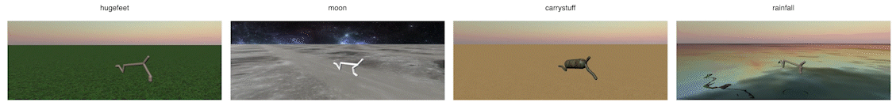
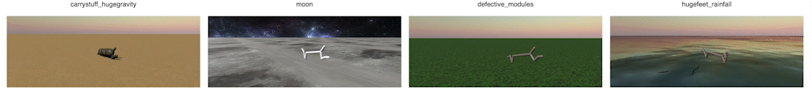
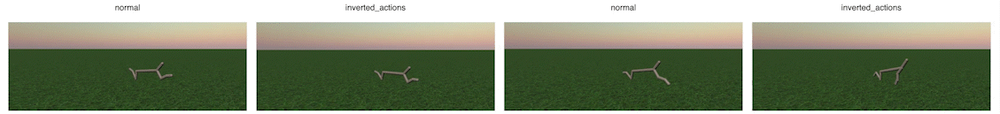
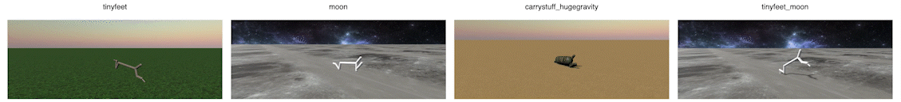

# salina_cl

This package aims at providing Continual RL (CRL) algorithms in the SaLinA Library. It is a development branch which may change drastically in the next months






## Get started
Simply run the file `run.py` with the desired config available in [configs](configs/). You can select one of them with the flag `-cn=my_config`. Different scenarios are available in [configs/scenario](configs/scenario/). Simply add `scenario=my_scenario` as an argument. For example if you want to run the CSP method on the forgetting scenario of halfcheetah:
 ```console
python run.py -cn=csp scenario=halfcheetah/forgetting_short
```

## Organization

The `core.py` file contains the building blocks of this framework. Each experiment consists in running a `Model` over a `Scenario`, i.e. a sequence of train and test `Task`. The models are learning procedures that use salina agents to interact with the tasks and learn from them through one or multiple algorithms.

* [models](models/) contains generic learning procedures (e.g. using only one algorithm, or adding a regularization method in the end)
* [scenarios](scenarios/) contains CRL scenarios i.e sequence of train and test tasks
* [algorithms](algorithms/) contains different RL / CL algorithms (ppo, sac, td3, ewc regularization)
* [agents](agents/) contains salina agents (policy, critic, ...)
* [configs](configs/) contains the configs files of benchmarked methods/scenarios.