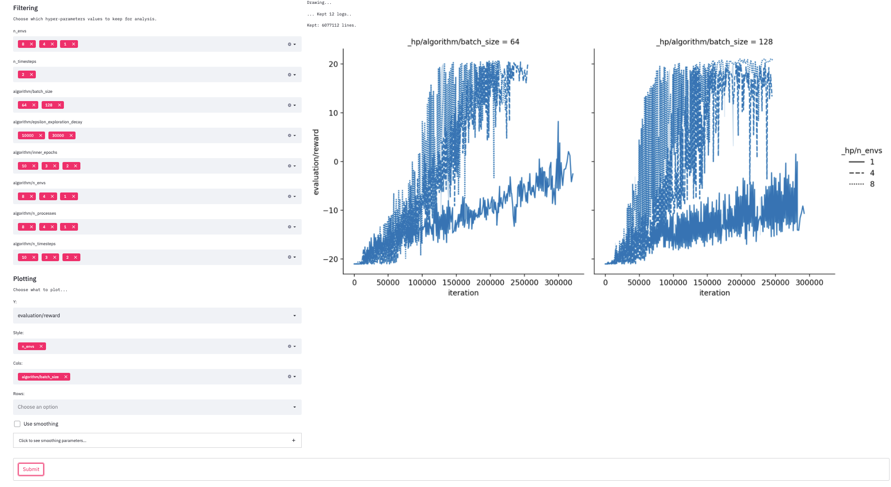

# Experiment Analysis

We provide a simple (streamlit) tools to facilitate the analysis of multiple logs. It assumes that multiples logs have been generated in a particular directory (with one log per sub-directory) with different parameters values (but same parameters names). For instance, one can use the  `multirun` directory generated when launching an experiment in `--multirun` mode with `hydra`.

To launch the tool over the directory of logs:
```
streamlit run analysis.py directory_logs
```

## Screenshot


