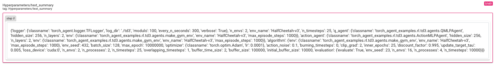
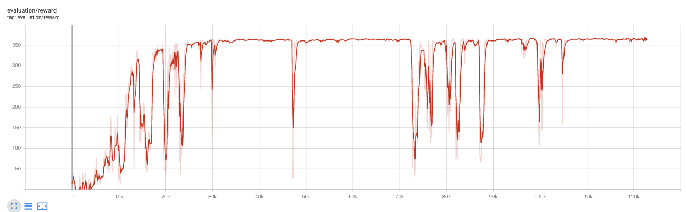
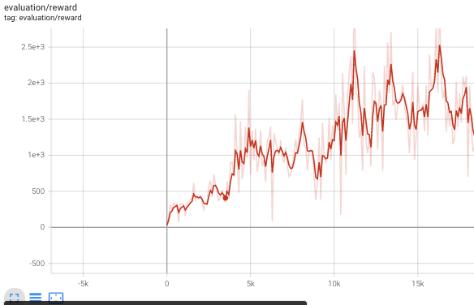

# DDPG Benchnmark

* All logger files are available at [https://drive.google.com/drive/folders/1KYWL6jqi8OTbOM2BDqyNdJ5BrLheBCGZ?usp=sharing](https://drive.google.com/drive/folders/1KYWL6jqi8OTbOM2BDqyNdJ5BrLheBCGZ?usp=sharing)
* Logger files can be read using `tensorboard` or [the experiment analysis tools](../../experiments_analysis) we provide.

We extract the most meaningful results in the next sections.

## MUJOCO results

Using `ddpg/benchmark`. Note that hyper-parameters used here are the same than TD3 and we did not make a big tuning of the hyper-parameters. Results are quite good, but may have a little bit of instabiity. Also, please consider that we are using a fixed `action_noise` while DDPG can be better when have a scheduled decreasing `action_noise`. Anyway, results are on-par wth published ones.

### HalfCheetah
  
### Ant
 
### Swimmer
  
### Walker2d
  
