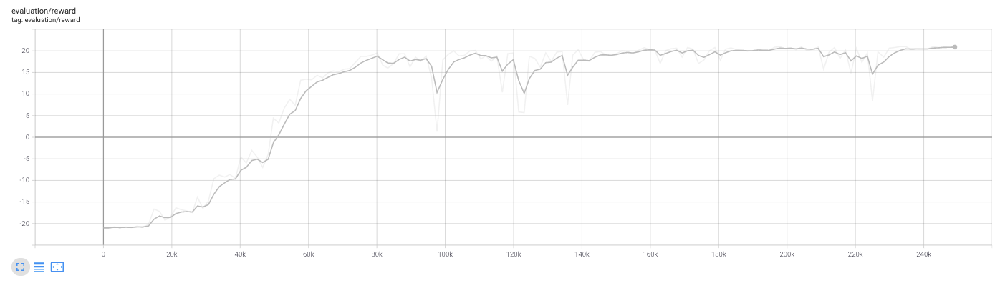
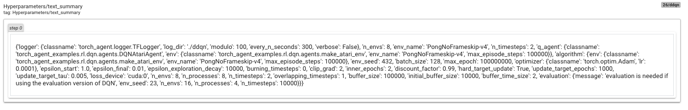

# DQN Benchnmark

* All logger files are available at [https://drive.google.com/drive/folders/1KYWL6jqi8OTbOM2BDqyNdJ5BrLheBCGZ?usp=sharing](https://drive.google.com/drive/folders/1KYWL6jqi8OTbOM2BDqyNdJ5BrLheBCGZ?usp=sharing)
* Logger files can be read using `tensorboard` or [the experiment analysis tools](../../experiments_analysis) we provide.

We extract the most meaningful results in the next sections.

## Pong results

Using `double_dqn/benchmark`:

- Optimal score reached in about 1 hour (8 CPUS + 1 GPU)
- Almost same resuts obtained with 4 CPUs
