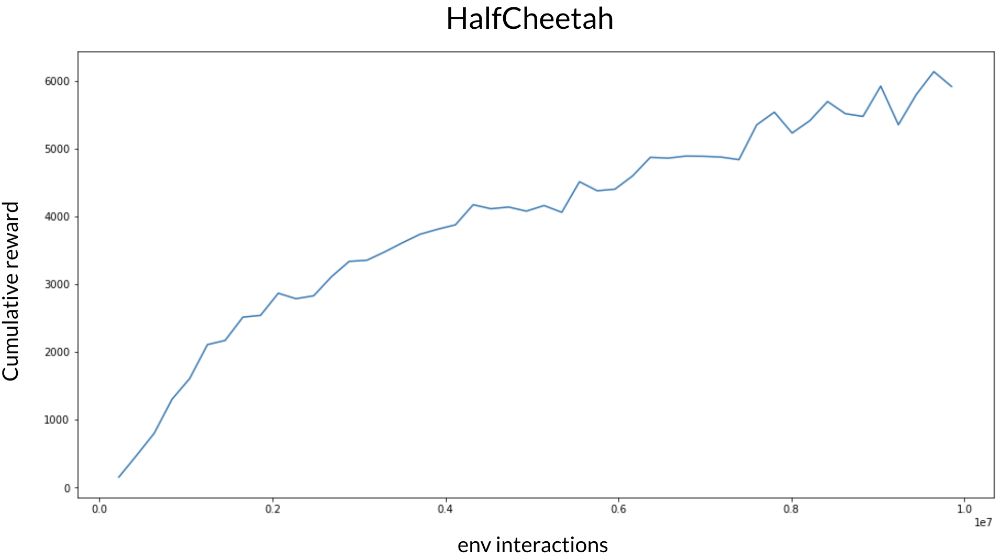

# PPO benchmark on brax environments

You need to install [BRAX](https://github.com/google/brax). Since BRAX is still on heavy development, some errors may happen with lastest version. Please open an issue if you see any problem.

We benchmarked PPO on several complex continuous control tasks coming from Brax suit (https://github.com/google/brax). We provide in this section results and hyperparameters to reproduce the experiments on GPU (both acquisition and loss computation).

## Results

The following curves are obtained by with the hyperparameters we provide in the `yaml` files (averaged over 5 different seeds). Run are bout 30 minutes using one single GPU.

## Running experiments
 * Make sure your version of Brax is up to date (https://github.com/google/brax)
 * Run `OMP_NUM_THREADS=1 XLA_PYTHON_CLIENT_PREALLOCATE=false python ppo.py`
