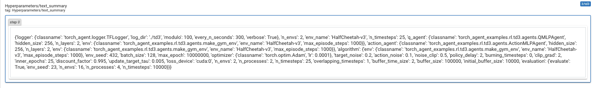

# TD3 Benchnmark

* All logger files are available at [https://drive.google.com/drive/folders/1KYWL6jqi8OTbOM2BDqyNdJ5BrLheBCGZ?usp=sharing](https://drive.google.com/drive/folders/1KYWL6jqi8OTbOM2BDqyNdJ5BrLheBCGZ?usp=sharing)
* Logger files can be read using `tensorboard` or [the experiment analysis tools](../../experiments_analysis) we provide.

We extract the most meaningful results in the next sections.

## MUJOCO results

Using `td3/benchmark`:

### HalfCheetah
  
### Ant
 
### Hopper
 
### Swimmer
  
### Walker2d
  
